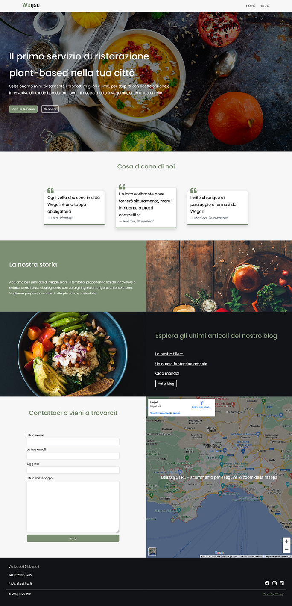

# Progetto Wordpress per Start2Impact

## Descrizione

Il progetto prevede la creazione di un sito attraverso Wordpress, che includa un form contatti ed una mappa.

Ho creato un tema da zero utilizzando come guida il Codex di Wordpress, inserendo tutte le pagine necessarie per il corretto funzionamento del sito.

Oltre ai requisiti poi, ho arricchito la homepage con altre sezioni descrittive (recensioni, abstract, articoli recenti) e ho inserito un blog. Ho curato il layour responsive, la palette colori, il branding e ultimo, ma non meno importante, l'inserimento di frequenti CTA per lo spostamento e il reindirizzamento sul sito.

### Cosa ho utilizzato

- Bootstrap
- Font Awesome
- Contact Form 7
- WP All In One Migration

## Come clonare il progetto

- Scaricare l'archivio `wp_export.zip` presente nel repository ed estrarlo.
- Importare il file di backup attraverso il plugin WP-All-In-One-Migration.

## Screenshot

